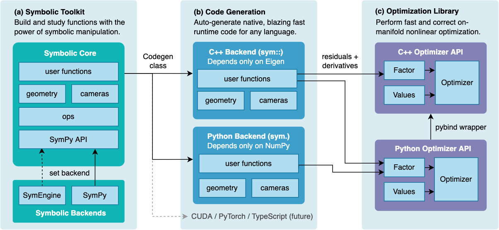

<h1 align="center">UTS_RobotikaSymforce</h1>

## Dokumentasi Symforce
### Muhammad Syaiful Rahman_1103192198


<!-- DARK_MODE_ONLY -->

<p align="center">
<a href="https://github.com/symforce-org/symforce/actions/workflows/ci.yml?query=branch%3Amain"></a>
<a href="https://symforce.org"></a>
<a href="https://github.com/symforce-org/symforce"></a>
<a href="https://github.com/symforce-org/symforce/issues"></a>


<a href="https://pypi.org/project/symforce/"></a>
<a href="https://github.com/symforce-org/symforce/tree/main/LICENSE"></a>
</p>

SymForce merupakan komputasi simbolik cepat dan pustaka pembuatan kode untuk aplikasi robotika seperti visi komputer, estimasi keadaan, perencanaan gerak, dan kontrol. Ini menggabungkan kecepatan pengembangan dan fleksibilitas matematika simbolik dengan kinerja kode yang dibuat secara otomatis dan sangat dioptimalkan dalam C++ atau bahasa runtime target apa pun. 

#### SymForce berisi tiga sistem yang berguna secara independen:

+ **Symbolic Toolkit** - dibangun di atas SymPy API untuk menyediakan tipe geometris dan kamera yang ketat, kalkulus grup kebohongan, penanganan singularitas, dan alat untuk memodelkan masalah kompleks

+ **Pembuat Kode (Code Generator)** - mengubah ekspresi simbolik menjadi kode tanpa cabang yang sangat cepat dengan API bersih dan ketergantungan minimal, dengan sistem templat untuk menargetkan bahasa apa pun

+ **Pustaka Pengoptimalan (Optimization Library)** - pustaka pengoptimalan ruang tangen cepat berdasarkan grafik faktor, dengan implementasi yang sangat optimal untuk aplikasi robotika waktu nyata

SymForce secara otomatis menghitung ruang singgung Jacobians, menghilangkan kebutuhan akan turunan tulisan tangan yang rawan bug. Fungsi yang dihasilkan dapat langsung digunakan sebagai faktor dalam pengoptimal nonlinier kami. Alur kerja ini memungkinkan fungsi runtime lebih cepat, waktu pengembangan lebih cepat, dan lebih sedikit baris kode tulisan tangan dibandingkan metode alternatif.

SymForce dikembangkan dan dikelola oleh Skydio. Ini digunakan dalam produksi untuk mempercepat tugas-tugas seperti SLAM, penyesuaian bundel, kalibrasi, dan MPC nonlinier jarang untuk robot otonom dalam skala besar.

<br/>



<br/>

Contoh dari implementasi symforce adalah:
- Computer Vision
- State Estimation
- Motion Planning
- Robot Controls

#### FITUR :

+ Implementasi simbolik geometri dan tipe kamera dengan operasi grup Lie
+ Pembuatan kode dari kode runtime asli yang cepat dari ekspresi simbolik, mengurangi duplikasi dan meminimalkan bug
+ Alat baru untuk menghitung jacobian ruang singgung yang cepat dan benar untuk ekspresi apa pun, menghindari semua turunan tulisan tangan
+ Strategi untuk meratakan komputasi dan memanfaatkan sparsity yang dapat menghasilkan 10x percepatan dibandingkan autodiff standar
+ Pustaka pengoptimalan ruang tangen cepat di C++ dan Python berdasarkan grafik faktor
+ Prototyping cepat dan analisis masalah kompleks dengan matematika simbolik, dengan alur kerja mulus ke penggunaan produksi
+ Pembuatan kode Eigen yang di-embedded-friendly dengan C++ dengan alokasi memori dinamis nol
+ Kode yang sangat berkinerja, modular, teruji, dan dapat diperluas

<h2 align="center">Spesifikasi Hardware dan rekomendasi software</h2>

##### Rekomendasi spesifikasi hardware minimal:

- CPU 4 core
- RAM 8 GB
- Mem 50 GB


##### Rekomendasi software yang harus diinstall:

- [Ubuntu 20.04 ++](https://ubuntu.com/download/desktop)
- [Python 3.8+](https://www.python.org/downloads/)
- [Jupyter notebook](https://jupyter.org/)
- [Visual studio code editor](https://code.visualstudio.com/)

<h1 align="center">Studi Kasus</h1>

Contoh Studi Kasus dalam hal ini ialah Robot bergerak melalui bidang 2D dan memiliki goal untuk memperkirakan pose pada beberapa langkah kedepan dengan sebuah pengukuran kebisingan (noisy measurements). 

Pengukuran yang harus dilakukan oleh Robot :

 * Jarak yang ditempuh dengan menggunakan sensor odometri
 * Sudut relatif menuju landmark.

Berdasarkan kasus di atas, maka robot memiiki sudut dengan tujuan yang berlawanan arah jarum jam dari sumbu x. Oleh karena itu, pengukuran sudut relatif ditentukan dari arah robot akan maju. Berikut adalah gambar berdasarkan kasus robot yang kita miliki :


<h2 align="center">Contoh Studi kasus</h2>

Kali ini studi kasus yang dilakukan adalah robot akan bergerak pada bidang 2 dimensi untuk memperkirakan pose dari langkah selanjutnya menggunakan pengukuran kebisingan. Robot akan mengukur sudut relatif landmark dan jarak tempuh dengan sensor odometri.


Menurut studi kasus di atas tahapan yang akan dilakukan adalah:

1. Import librari symforce

```python
import symforce.symbolic as sf
```

2. Membuat simbolik pose 2 dimensi dan lokasi landmark, menggunakan method symbolic pada library symforce 

```python
pose = sf.Pose2(
    t=sf.V2.symbolic("t"),
    R=sf.Rot2.symbolic("R")
)
landmark = sf.V2.symbolic("L")
```

3. Transformasi landmark kedalam frame lokal robot

```python
landmark_body = pose.inverse() * landmark
```

4. Inisialisasi metode jacobian dari landmark body-frame dengan pendekatan tangent-space dari pose 2

```python
landmark_body.jacobian(pose)
```

5. Melakukan perhitungan sudut relatif bearing

```python
sf.atan2(landmark_body[1], landmark_body[0])
```

6. Menambahkan fungsi epsilon 

```python
sf.V3.symbolic("x").norm(epsilon=sf.epsilon())
```
